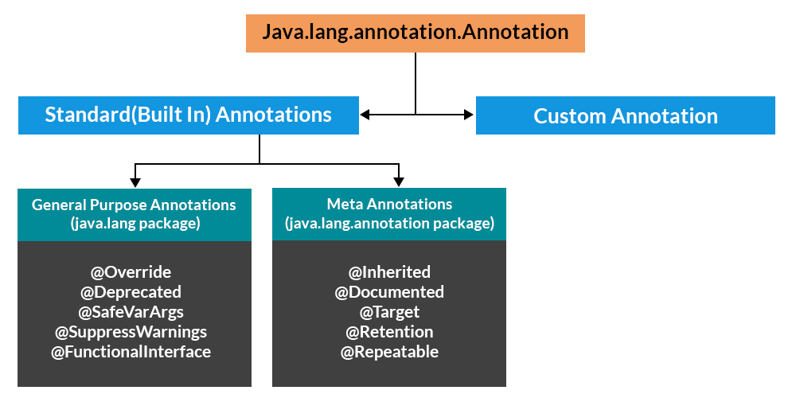

# Annotation-in-Java

##  <i> There are broadly 5 categories of annotations as listed: </i>

* Single value Annotations
* Marker Annotations
* Full Annotations
* Type Annotations
* Repeating Annotations

##  <i>  Predefined/ Standard Annotations </i>

Java popularly defines seven built-in annotations 

* Four are imported from java.lang.annotation: @Retention, @Documented, @Target, and @Inherited.
* Three are included in java.lang: @Deprecated, @Override and @SuppressWarnings

## How Annotations Work

Annotations in Java are processed at compile time or runtime, depending on their retention policy. The retention policy is specified by the @Retention annotation, and it can be one of three values: SOURCE, CLASS, or RUNTIME.

<b> SOURCE </b>: Annotations are only available in the source code and are discarded during compilation.  
<b> CLASS </b>: Annotations are included in the class file but not accessible at runtime. 
<b> RUNTIME </b>: Annotations are retained at runtime and can be accessed programmatically through reflection. 
The @Target annotation specifies the types of program elements to which an annotation can be applied. For example, if an annotation is designed for methods, you would use @Target(ElementType.METHOD).

# Conclusion
In conclusion, Java annotations are a versatile feature that adds a layer of metadata to your code, enabling better tooling, code analysis, and code generation. Creating custom annotations allows you to express specific requirements or behaviors in a concise and declarative manner.

Understanding the basics of annotations, their retention policies, and how to access them through reflection provides a solid foundation. Moreover, exploring meta-annotations, annotation processors, and advanced topics such as repeating annotations, conditional annotations, and annotation inheritance takes your annotation capabilities to the next level, enabling more sophisticated use cases.

As you continue to explore and leverage Java annotations, you’ll find that they play a crucial role in enhancing the readability, maintainability, and extensibility of your codebase. So, embrace the power of annotations and use them judiciously to make your Java projects more robust and expressive. Happy coding!

Java
